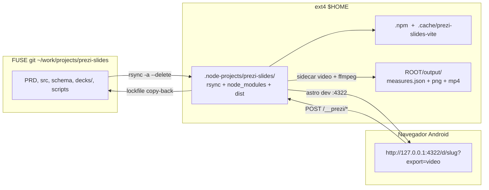
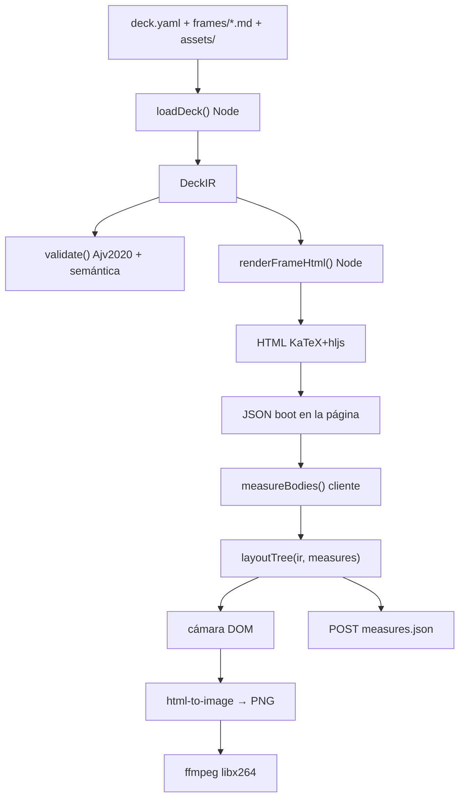
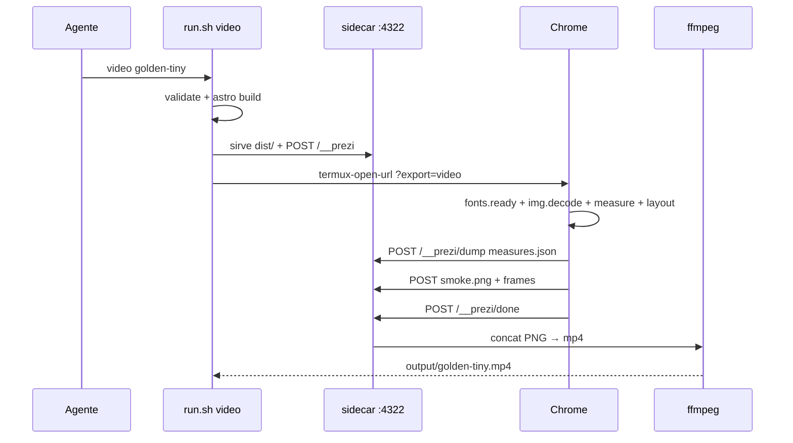

# SDD — prezi-slides

| Campo | Valor |
| --- | --- |
| **Título** | Visor espacial de decks (lienzo 2D, cámara, texto en git) |
| **Autor** | prezi-slides (SDD) |
| **Fecha** | 2026-09-21 |
| **Estado** | Draft (rev. 4) |
| **Producto (fuente)** | [`PRD.md`](/storage/emulated/0/Documents/work/projects/prezi-slides/PRD.md) |
| **Código** | `/storage/emulated/0/Documents/work/projects/prezi-slides/` (`~/work/projects/prezi-slides/`) |
| **Hermano (patrón Termux)** | `/storage/emulated/0/Documents/work/projects/revista-laboratorio/` |

Este documento baja el PRD a implementación. **No reabre** decisiones de producto (lienzo infinito, frames anidados, sin rotación, sin editor visual, Markdown+LaTeX, un tema editorial, HTML estático + MP4, fixture QG, API de agente = archivo + validador).

**Alineación con el PRD:** las rutas mínimas son `/` y `/d/<slug>`; v1 añade `/acerca` (opcional en el PRD, no bloquea el criterio de hecho). El componente de cámara es un `<script>` **procesado de Astro, sin atributos** (vanilla TS), **nunca** `client:*`. En Astro, `client:*` no hidrata un `.astro` y no hay `@astrojs/react` en v1.

---

## Overview

**prezi-slides** es un visor web local de presentaciones espaciales: un árbol de frames en un lienzo 2D, una cámara que hace pan+zoom a lo largo de un path, y un **deck en texto** (carpeta Git: manifiesto YAML + un Markdown por frame) como única fuente de verdad. La UI no escribe coordenadas. Un agente (o un humano en el editor) edita archivos, corre `validate`, y mira el resultado en Chrome/Samsung Internet de la Galaxy Tab S10+.

El stack reutiliza el de **revista-laboratorio**: Astro 5.x `output: 'static'`, npm (no pnpm), working copy **rsync a ext4** (`$HOME/.node-projects/prezi-slides`). El motor (carga, schema, layout, cámara) es TypeScript puro. El HTML de cada frame se prerendera en Node (KaTeX + markdown-it). El cliente solo mide, coloca y anima la cámara.

El MP4 de v1 **no** usa Playwright ni un segundo typesetter SVG. Captura el **mismo DOM** del presentador (html-to-image en Chrome) a través de un sidecar HTTP que escribe PNG y llama a ffmpeg. Las cajas salen del protocolo de medida del visor (`measures.json`); la cámara es `camera.ts`. Geometría idéntica al visor (PRD §12.2).

---

## Background & Motivation

Estado actual:

- El repo `~/work/projects/prezi-slides/` solo contiene el PRD.
- revista-laboratorio ya resolvió Node-en-FUSE: git en `~/work`, install root en `$HOME/.node-projects/<nombre>`, `run.sh` sin `exec`, bucle rsync `--size-only`, `astro@^5.14.0`, puerto 4321, paleta crema/tinta/borgoña.
- ffmpeg de Termux **incluye `libx264`** (verificado). Node 24.18, npm 11, Python 3.14. Playwright/Chromium headless **no** es viable. `rsvg-convert` **no** está en PATH. `WebAssembly.instantiate` sí existe; no se usa para el vídeo v1.

Dolores que el PRD nombra: Prezi no es git-diffable; las slides lineales no enseñan un mapa jerárquico. Hace falta un artefacto que un agente pueda validar sin ejecutar código del deck.

---

## Goals & Non-Goals

### Goals (v1)

- Formato en disco: `decks/<slug>/deck.yaml` + `frames/<id>.md` + `assets/`.
- CLI: `validate` / `dev` / `build` / `video` / `test` vía `run.sh` (cwd irrelevante).
- Visor: `/` índice, `/d/<slug>` presentador, `/acerca`. Next/prev/overview. UI en español.
- Layout determinista (`grid | row | column`), medible por tests con tamaños inyectados.
- Markdown (subconjunto) + KaTeX `$...$` / `$$...$$` + highlighter, sobre papel `#F6F1E7`.
- `astro build` → presentador estático servible (no `file://`).
- `video` → `output/<slug>.mp4` (1280×800, 30 fps, hold 3 s + vuelo interpolado) con **la misma geometría** que el visor.
- Fixture `decks/quasi-geostrofica/` **solo en el PR de contenido** (no un stub inválido antes).
- Tests: schema, layout, golden tiny.

### Non-goals (heredados del PRD)

- Editor visual, write-back espacial, rotación, pinch-explore, path con ramas.
- MCP CRUD, notas de presentador, Mermaid, Excalidraw, HTML/CSS por frame, temas múltiples, PDF, narración.
- Auth, nube, deploy público, APM, feature flags.
- React/Vue/Svelte/Three.js/WebGL. Python en runtime del visor.
- `node_modules` / `.venv` / symlinks dentro de `~/work`.
- Typesetter SVG paralelo (resvg / MathJax-SVG) como raster de v1.

---

## Key Decisions

1. **Carpeta por deck, un Markdown por frame + `deck.yaml`.** Cumple PRD §6. Un YAML monolítico se rechaza. El árbol se declara con `children` en el padre (una sola dirección). **`id` ≡ basename** de `frames/<id>.md` (sin `.md`).

2. **Astro 5.14 estático + motor TS vanilla, mismo patrón Termux que revista.** `astro@^5.14.0`, `output: 'static'`, npm hoisted, ROOT `$HOME/.node-projects/prezi-slides`. Puerto **4322** (revista usa 4321). Isla = `<script>` procesado **sin** atributos; **prohibido** `client:load` / `client:*`.

3. **Validador JS en el mismo proyecto.** Schema Draft 2020-12 con **`Ajv2020`** (`ajv/dist/2020`), no `new Ajv()`. CLI: `scripts/cli.ts` con `--experimental-strip-types`.

4. **Lienzo = DOM + un `transform` CSS en `.world`.** Frames son **siblings absolutos** (no DOM anidado) para no componer escalas. Canvas 2D y SVG-as-runtime se rechazan para el visor.

5. **Grid: `cols = max(1, ceil(sqrt(n)))`.** Row-major. Celdas no estiran al hijo.

6. **Overrides parciales `geometry: {x,y,width,height}`.** `width`/`height` **antes** del packer; `x`/`y` **después** (no reflow de hermanos; hueco u `overlap`). Solape AABB = error duro, no clamp. `0` es valor (clave ausente vs presente). Root ignora `x,y`. Alineación PRD §8: «el resto se relayouta» = las **tallas** overridden reentran al packer de hermanos y a la caja del padre; un `x,y` no reempaqueta a los demás.

7. **KaTeX 0.16.x `renderToString` solo en Node/build.** El cliente no vuelve a pinta math: recibe HTML ya hecho. highlight.js 11 en Node. Páginas Astro (`/acerca`) no usan el pipeline de frames.

8. **Cámara: 1000 ms, `easeInOutCubic`, lerp de centro y `log(scale)`.** Pad de encuadre 12 %. Override por paso: `duration_ms`.

9. **Sin deep links en v1.** Recarga → paso 0 del path.

10. **Vídeo v1 = captura in-página del visor + ffmpeg.** Seek de cámara (`applyCamera` → `toPng(.viewport)`), **nunca** `.world` y **nunca** espera wall-clock de `hold_ms`. `.viewport { overflow: hidden }` y en export 1280×800 fijos. Sidecar + `libx264`. `measures.json` obligatorio. Sin estimador. Sin resvg/MathJax/Georgia.

11. **Tests con `node --test --experimental-strip-types`.** Fixtures en `decks/golden-tiny/` y `tests/fixtures/`. Sin `enum` ni parameter properties (strip-types). Sin `import.meta.env` en `src/engine/**`.

12. **Working copy: copiar los scripts *reales* de revista-laboratorio** (`run.sh`, `rsync-to-root.sh`, `termux-setup.sh`, `check-not-fuse.mjs` del git actual, no del listado de un SDD viejo) y sustituir nombres (`PREZI_*`), ROOT, puerto 4322, exclude extra `output/`. El `run.sh` real mata el loop con SID==PID (`ps -o sid=`).

13. **Ancho de cuerpo congelado tras medir.** Nunca `width: 100%` del padre sobre `.frame-body`. Protocolo: CSS editorial+KaTeX, `fonts.ready`, `img.decode()`, un re-measure, luego mostrar. `.world` arranca con `visibility: hidden` (clase `.is-pending`), **sin** atributo HTML `hidden` (`display: none`).

---

## Proposed Design

### Arquitectura



El proceso Node **solo** corre sobre ROOT ext4.

### Flujo de datos





### Layout del repositorio (git / FUSE)

Árbol **al cierre del PR 9**. El PR 1 no tiene motor ni `[slug].astro`. **`decks/quasi-geostrofica/` no existe hasta el PR 8.**

```
~/work/projects/prezi-slides/
├── PRD.md
├── README.md
├── package.json
├── package-lock.json
├── astro.config.mjs
├── tsconfig.json
├── .npmrc
├── .gitignore
├── run.sh
├── schema/
│   └── deck.schema.json
├── scripts/
│   ├── rsync-to-root.sh          # copiado del git de revista, nombres PREZI_*
│   ├── termux-setup.sh
│   ├── check-not-fuse.mjs
│   └── cli.ts                    # validate | video | test  (no .mjs)
├── src/
│   ├── engine/
│   │   ├── types.ts
│   │   ├── load.ts               # loadDeck, loadAllDecks
│   │   ├── validate.ts
│   │   ├── math-extract.ts       # fences + $ ; usado desde PR 2
│   │   ├── layout.ts
│   │   ├── camera.ts             # puro; Node + cliente
│   │   ├── markdown.ts           # Node only
│   │   ├── debug.ts              # PREZI_DEBUG=1
│   │   ├── layout.test.ts
│   │   └── validate.test.ts
│   ├── integrations/
│   │   └── deck-assets.ts        # integración Astro (no plugin Vite suelto)
│   ├── viewer/
│   │   ├── present.ts            # cliente only
│   │   ├── measure.ts            # cliente only
│   │   └── capture.ts            # cliente; html-to-image
│   ├── video/
│   │   └── server.ts             # sidecar POST + static dist
│   ├── styles/
│   │   └── editorial.css
│   ├── layouts/Base.astro
│   ├── components/
│   │   ├── Masthead.astro
│   │   ├── DeckList.astro
│   │   └── Presenter.astro
│   └── pages/
│       ├── index.astro
│       ├── acerca.astro
│       └── d/[slug].astro
├── decks/
│   └── golden-tiny/
│       ├── deck.yaml
│       ├── frames/{root,hoja-a,hoja-b}.md
│       └── assets/punto.svg
├── tests/
│   └── fixtures/
└── public/
    └── favicon.svg
```

`.gitignore`: `node_modules/`, `dist/`, `.astro/`, `output/`, `.obsidian/`.

### Install root (ext4)

```
$HOME/.node-projects/prezi-slides/
├── (árbol rsync)
├── node_modules/
├── dist/
├── output/                 # measures, png, mp4; exclude del rsync --delete
├── .astro/
└── .rsync-loop.pid
```

Caché Vite: `$HOME/.cache/prezi-slides-vite`.

### Módulos: de qué lado corren

| Módulo | Lado | Notas |
| --- | --- | --- |
| `load.ts`, `validate.ts`, `markdown.ts`, `math-extract.ts` | **Node** | `fs`, `js-yaml`, KaTeX, hljs. **No** importar desde `present.ts` / `measure.ts` / `capture.ts` |
| `layout.ts`, `camera.ts`, `types.ts`, `debug.ts` | **ambos** | puros; sin `fs`, sin `import.meta.env` |
| `present.ts`, `measure.ts`, `capture.ts` | **cliente** | DOM, `html-to-image` |
| `video/server.ts`, `scripts/cli.ts` | **Node** | sidecar + dispatch |
| `Presenter.astro` | build + `<script>` cliente | no `client:*` |
| `index.astro` / `Base.astro` | Node | **prohibido** importar `Presenter.astro` ni `present.ts` |

---

## Cómo instalar y correr en Termux FUSE

Contrato idéntico en espíritu a revista. **Fuente de los bash:** copiar `run.sh`, `scripts/rsync-to-root.sh`, `scripts/termux-setup.sh`, `scripts/check-not-fuse.mjs` **del árbol git actual** de `revista-laboratorio/` (el `run.sh` real usa SID==PID con `ps -o sid=`, no `loop_is_session` de un SDD desfasado). Luego sustituir:

| revista | prezi-slides |
| --- | --- |
| `REVISTA_*`, `REVISTA_ALLOW_FUSE_NPM` | `PREZI_*`, `PREZI_ALLOW_FUSE_NPM` |
| `$HOME/.node-projects/revista-laboratorio` | `$HOME/.node-projects/prezi-slides` |
| `revista-laboratorio-vite` | `prezi-slides-vite` |
| puerto 4321 | **4322** |
| excludes | los de revista **más `output/`** |

No re-derivar el loop/`trap` desde prosa. `run.sh` **sin `exec`**. Tick `--size-only`.

### Por qué no `npm install` en el repo

FUSE: `EPERM` en symlinks, ELF no ejecuta, inotify muerto. Node **24.18.0**, npm **11.19.1**, ffmpeg con `libx264`, `pkg install rsync`. No pnpm.

### `.npmrc`

Igual que revista, comentario apuntando a `$HOME/.node-projects/prezi-slides`.

### `package.json`

```json
{
  "name": "prezi-slides",
  "private": true,
  "type": "module",
  "engines": { "node": ">=22" },
  "dependencies": {
    "astro": "^5.14.0",
    "katex": "^0.16.22",
    "markdown-it": "^14.1.0",
    "js-yaml": "^4.1.0",
    "ajv": "^8.17.1",
    "highlight.js": "^11.11.1",
    "html-to-image": "^1.11.13"
  },
  "scripts": {
    "preinstall": "node scripts/check-not-fuse.mjs",
    "dev": "astro dev --host 0.0.0.0 --port 4322",
    "build": "astro build",
    "preview": "astro preview --host 0.0.0.0 --port 4322",
    "validate": "node --experimental-strip-types scripts/cli.ts validate",
    "video": "node --experimental-strip-types scripts/cli.ts video",
    "test": "node --test --experimental-strip-types src/engine/*.test.ts"
  }
}
```

`NODE_OPTIONS=--experimental-strip-types` no es obligatorio si cada script lo lleva. Pin `html-to-image`: línea 1.11.x conocida (`toPng`); **verificar al implementar** el import ESM (`import { toPng } from 'html-to-image'`). No hay `resvg` ni `mathjax-full` en v1.

Strip-types: **no** `enum`, **no** parameter properties, **no** `namespace`. `debug.ts` lee `process.env.PREZI_DEBUG` en Node y `false` en cliente (inyectar `const DEBUG = false` o leer `localStorage` no; el cliente usa `globalThis.__PREZI_DEBUG` opcional). Función `debugLayout(...args)` no-op salvo `PREZI_DEBUG=1`.

`check-not-fuse.mjs` permanece `.mjs` (lo llama `preinstall` sin flags).

Uso:

```bash
bash ~/work/projects/prezi-slides/scripts/termux-setup.sh
bash ~/work/projects/prezi-slides/run.sh
bash ~/work/projects/prezi-slides/run.sh build
bash ~/work/projects/prezi-slides/run.sh preview
bash ~/work/projects/prezi-slides/run.sh validate [slug]
bash ~/work/projects/prezi-slides/run.sh video [slug]
bash ~/work/projects/prezi-slides/run.sh video --smoke [slug]
bash ~/work/projects/prezi-slides/run.sh test
bash ~/work/projects/prezi-slides/run.sh sync
```

`run.sh` reenvía `validate|video|test` a `npm run` en ROOT (tras rsync). Editar el git, no ROOT.

### `astro.config.mjs`

```js
import { defineConfig } from 'astro/config';
import os from 'node:os';
import path from 'node:path';
import deckAssets from './src/integrations/deck-assets.ts';

export default defineConfig({
  output: 'static',
  server: { host: true, port: 4322 },
  image: { service: { entrypoint: 'astro/assets/services/noop' } },
  integrations: [deckAssets()],
  vite: {
    cacheDir: path.join(os.homedir(), '.cache/prezi-slides-vite'),
    server: { host: true, port: 4322 },
  },
});
```

Sin adapter, sin React, sin `sharp`, **sin** `vite.plugins` para assets.

Integración `src/integrations/deck-assets.ts` (hooks de Astro, no de Vite):

- `astro:server:setup`: `middleware` que si `url.pathname` empieza por `/deck-assets/<slug>/` sirve el archivo `decks/<slug>/assets/<resto>` con `fs.createReadStream`. Rechazar `..`. **No** depender de `sirv` como paquete directo.
- `astro:build:done`: copiar cada `decks/<slug>/assets/*` → `dist/deck-assets/<slug>/`. Test de build (PR 5): existe `dist/deck-assets/golden-tiny/punto.svg`.
- `astro:server:setup` (dev): también montar `POST /__prezi/dump` escribiendo `output/<slug>.measures.json` (mismo handler que el sidecar de vídeo; extraer función compartida). En `astro preview` **no** hay estos hooks: el dump/vídeo van por el sidecar.

Rewrite de imágenes en `markdown.ts`: `assets/foo.png`, `./assets/foo.png` → `/deck-assets/<slug>/foo.png`. Rechazar omisión de extensión, `.jpg`, URLs.

---

## Formato en disco (PRD §6)

### Convención de rutas

| Pieza | Ruta |
| --- | --- |
| Manifiesto | `decks/<slug>/deck.yaml` |
| Frame | `decks/<slug>/frames/<id>.md` |
| Asset | `decks/<slug>/assets/<archivo>.{png,svg}` |
| Schema | `schema/deck.schema.json` |

`slug` del directorio = `deck.yaml:slug`. IDs: `^[a-z][a-z0-9-]{0,63}$`. `id` del frontmatter = filename.

### `deck.yaml`

```yaml
slug: golden-tiny
title: Golden tiny
lang: es
theme: editorial
root: root
camera:
  duration_ms: 1000
video:
  hold_ms: 3000
path:
  - id: root
  - id: hoja-a
  - id: root
  - id: hoja-b
    duration_ms: 800
```

Atajo: un ítem string (`- hoja-a`) ≡ `{id: hoja-a}`. El schema acepta `oneOf` string | objeto (`$defs.PathStep`). El loader normaliza.

Campos no permitidos: `notes`, `css`, `html`, `rotate`, `theme` ≠ `editorial`.

### Frame Markdown

El padre lista hijos; el hijo no declara `parent`. Un id en **dos** listas `children` → error `child-multi-parent` (árbol, no DAG).

```markdown
---
id: root
layout: row
children:
  - hoja-a
  - hoja-b
---

# Mini-deck de prueba

Dos fichas hermanas. El path visita el root, una hoja, otra vez el root, y la otra hoja.
```

`frames/hoja-a.md`: título, `$R_o = U/fL$`, un `$$...$$`, ``.

`frames/hoja-b.md`: lista + fence `python`.

**Padres con Markdown completo:** cuerpo encima del área de hijos.

### Árbol QG (ids; sin prosa, sin directorio hasta PR 8)

El slug será `quasi-geostrofica`. Agrupación ajustable al redactar (PRD §14). Ids previstos: `root`, `motivacion`, `rossby`, `por-que-no-ns`, `geostrofia`, `equilibrio`, `limites`, `qgpv`, `qgpv-def`, `omega`, `omega-eq`, `corolario`, `ondas-rossby`. ~4–7 padres, ~15–25 frames, path con root y padres, ≥1 imagen, `lang: es`. **No crear** `decks/quasi-geostrofica/` en PRs 1–7: `run.sh validate` (todos) no debe fallar por un stub.

### Qué no hay en disco

- JS embebido como fuente.
- Write-back de coordenadas.
- Layout lock. `output/<slug>.measures.json` es **derivado** (sí se escribe; no se commitea).

---

## Modelo interno (DeckIR)

Tipos como en rev. 1 (`LayoutMode`, `Geometry`, `PathStep`, `FrameIR`, `DeckIR`, `Rect`, `Size`, `LayoutMap`).

`loadDeck(deckDir: string): DeckIR`. `loadAllDecks(rootDir = 'decks'): DeckIR[]` — lista directorios que contienen `deck.yaml` (PR 2).

Frontmatter: normalizar `\r\n` → `\n` **antes** del regex `/^---\n([\s\S]*?)\n---\n/`. Si no hay newline final tras el cierre, aceptar `/^---\n([\s\S]*?)\n---(?:\n|$)/`. `yaml.load` (no `eval`); exigir `object` y no `null`.

---

## JSON Schema y validador

**Archivo:** `schema/deck.schema.json`, `$schema: https://json-schema.org/draft/2020-12/schema`, `$defs`: `DeckManifest`, `FrameFrontmatter`, `PathStep`, `Geometry`.

Ajv:

```ts
import Ajv2020 from 'ajv/dist/2020';
const ajv = new Ajv2020({ allErrors: true, strict: false });
```

(`strict: false` si 2020-12 + YAML extras; **verificar** al implementar.) No usar `new Ajv()`.

Chequeos semánticos (`src/engine/validate.ts`), exit 1:

| Código | Condición |
| --- | --- |
| `schema` | Ajv rechaza manifiesto o frontmatter |
| `slug-mismatch` | directorio ≠ `slug` |
| `id-duplicate` | dos frontmatters con el mismo `id` (filenames distintos: `frames/a.md` y `frames/b.md` ambos con `id: foo`) |
| `id-filename` | basename ≠ `id` |
| `id-format` | regex de id |
| `layout-unknown` | layout no enum **y** no lo cazó Ajv (defensa); Ajv también rechaza `diagonal` como `schema` |
| `child-missing` | `children` cita id sin archivo |
| `child-multi-parent` | un id aparece en ≥2 listas `children` |
| `orphan-file` | md no alcanzable desde `root` |
| `cycle` | ciclo |
| `root-missing` | |
| `path-missing` | |
| `asset-missing` / `asset-remote` / `asset-type` / `asset-traversal` | |
| `theme` / `lang` | |
| `math` | KaTeX `throwOnError: true` |
| `unclosed-fence` | fence \`\`\` sin cierre |
| `markdown-html` | tag `<[A-Za-z]` fuera de fences y de \`inline code\` |
| `geometry-negative` | `x` o `y` &lt; 0 |
| `overlap` | AABB de hermanos **solo si** cada uno tiene `geometry.width` **y** `geometry.height` (talla de caja). Entonces se empaqueta con esas tallas, se aplican `x`/`y` si están, y se aplica §EPS. **Si falta talla en algún hermano, no emitir `overlap`.** El CLI **no** lee `measures.json` ni usa estimador 28 px/línea. El packer sin override y sin tallas no se evalúa (no solapa por construcción cuando hay medidas). Tests de overlap = `layout.test.ts` con medidas fake, no fixtures de `validate`. |

Tests de PRD §16: `ok === false` y el conjunto de códigos **intersecta** `{schema, layout-unknown, id-duplicate, id-filename, path-missing, asset-missing}` — no exigir un código único para `layout: diagonal` (puede ser `schema`).

Fixture `id-duplicate`: `tests/fixtures/id-duplicate/frames/a.md` (`id: foo`) y `frames/b.md` (`id: foo`); `deck.yaml` `root: foo` (inválido a propósito).

**Avisos** (exit 0): cuerpo &gt; 12 líneas de bloque; imagen sin alt; `duration_ms` fuera de 800–1200; contenido medido &gt; `geometry.width/height`.

### «Markdown ilegible» (PRD §13)

Desde **PR 2**, sin `markdown-it`: `math-extract.ts` recorre líneas, rastrea fences \`\`\`, extrae `$` / `$$` fuera de fences, llama KaTeX. Fences sin cierre → `unclosed-fence`. HTML crudo → `markdown-html`. Eso cumple §13 (TeX inválido + HTML + fence roto). PR 5 añade `markdown-it({ html: false })` como red de render; el validador no relaja.

CLI: `run.sh validate` = todos los `decks/*/deck.yaml` (solo golden-tiny hasta PR 8).

---

## Markdown, math, código, imágenes

Permitido: headings, párrafos, énfasis, listas, fences, imágenes locales, math. `markdown-it({ html: false, linkify: false })`. Enlaces http(s) de texto sí.

KaTeX en Node:

```js
katex.renderToString(tex, {
  displayMode,
  throwOnError: true, // validate; en HTML de visor true también (el deck ya validó)
  output: 'htmlAndMathml',
  fleqn: false,
});
```

CSS: `katex/dist/katex.min.css` + overrides tinta / `.katex-display { overflow: visible; margin: 0.75em 0; }`. Webfonts KaTeX: excepción al PRD §10.

highlight.js 11, `pre-wrap`, tema crema.

Imágenes: solo `assets/` o `./assets/`, `.png`/`.svg`. URL pública `/deck-assets/<slug>/<file>`.

---

## Algoritmo de layout

Extensión `hub`: `layoutScene(ir, measures)` devuelve `groups` (AABB de toda la rama, para Overview y el punto intermedio del vuelo) y `cards` (AABB de la tarjeta legible del frame, para los pasos del path). `layoutTree` sigue devolviendo los AABB de grupos como antes. Las direcciones opcionales de las hijas son `top`, `right`, `bottom`, `left`, con asignación determinista por índice. El empaquetado reserva una banda superior e inferior y una zona media para laterales y tarjeta; en cada lado admite varias ramas y verifica solapes entre cajas y tarjeta. Se mide el contenido real y se añade el padding de la tarjeta. Las ramas internas se miden antes de asignar espacio al padre.

`transition: via-group` en el paso de destino encuadra el ancestro común de origen y destino a mitad de la duración y termina en la tarjeta de destino. `flightCameras` y `cameraOnFlight` se comparten entre el visor y la captura, incluido el easing de cada tramo; al retroceder se reutiliza la transición declarada por el paso del que se vuelve.

Puro: `layoutTree(ir: DeckIR, measures: Record<string, Size>): LayoutMap`.

`measures[id]` = tamaño intrínseco del **cuerpo** ya maquetado (sin padding de frame, sin hijos), con el protocolo de abajo.

### Constantes (px mundo)

| Token | Valor |
| --- | --- |
| `CONTENT_MAX_WIDTH` | 440 |
| `FRAME_PAD_X` | 24 |
| `FRAME_PAD_Y` | 20 |
| `FRAME_GAP` | 40 |
| `PARENT_BODY_GAP` | 16 |
| `BORDER` | **1** (igual que el CSS de caja; ver dirección de arte) |
| `GRID_COLS(n)` | `max(1, Math.ceil(Math.sqrt(n)))` |
| `CAMERA_PAD_RATIO` | 0.12 |
| `CAMERA_DURATION_MS` | 1000 |
| `EPS` | 0.5 |

### Empaquetado

**row / column / grid** como rev. 1 (`ceil(sqrt(n))`, colW = max de la columna, rowH = max de la fila, hijo no estirado).

### Overrides — una pasada (bottom-up)

```
layoutFrame(id) → Rect world:
  body = measures[id]          # ya congelado
  childRectsLocal = []
  for childId of frames[id].children:
      sub = layoutFrame(childId)          # caja world provisional; usamos w/h
      w = ('width'  in geo(childId)) ? geo.width  : sub.width
      h = ('height' in geo(childId)) ? geo.height : sub.height
      childRectsLocal.push({ id: childId, w, h })
  slots = pack(childRectsLocal, frames[id].layout)   # x,y locales ≥ 0
  for each child:
      if ('x' in geo) child.x = geo.x     # 0 es válido; NO usar ||
      else child.x = slots[i].x
      if ('y' in geo) child.y = geo.y
      else child.y = slots[i].y
      if child.x < 0 or child.y < 0: error geometry-negative
  childrenArea = {
    width:  max(0, max over i of (child.x + child.w)),
    height: max(0, max over i of (child.y + child.h)),
  }
  innerW = max(body.width, childrenArea.width)
  innerH = body.height + (n>0 ? PARENT_BODY_GAP + childrenArea.height : 0)
  if ('width'  in geo(id)) outerW = geo.width  else outerW = innerW + 2*FRAME_PAD_X
  if ('height' in geo(id)) outerH = geo.height else outerH = innerH + 2*FRAME_PAD_Y
  return { x: TBD, y: TBD, width: outerW, height: outerH }

root: x=0, y=0 siempre (ignorar geometry.x/y del root).
hijos: world = origin_área_hijos(padre) + local.
```

`in geo` = clave **presente** (incl. 0), no truthy.

**PRD §8:** las tallas overridden participan del packer y agrandan al padre (`childrenArea` post-`x,y`). Las posiciones overridden **no** empujan hermanos (hueco o `overlap`). No es un segundo solver de empaquetado.

Contenido que desborda un `width`/`height` menor: aviso; `overflow: visible`; **no** entra en AABB ni en `overlap` (solo cajas exteriores). Tinta puede pintar encima del hermano; es error editorial, no silencioso recorte.

Tras el árbol (con `measures`): overlap entre hermanos en el visor y en `layout.test.ts`. El CLI `validate` solo corre overlap si hay tallas `geometry.width`+`height` en esos hermanos (fila de la tabla semántica).

### EPS

```
overlap(a,b) ⇔ area(intersect(inflate(a,-EPS), inflate(b,-EPS))) > 0
```

`inflate(r,-0.5)` encoge 0.5 px por lado. Toque de borde exacto **no** es overlap. Área estrictamente interior sí.

### Protocolo de medida (visor) — obligatorio

Medidor fuera de pantalla, **mismas hojas** que el presentador (`editorial.css` + `katex.min.css`), no un iframe con user-agent CSS.

```
.frame-body.measuring {
  width: 440px;           /* CONTENT_MAX_WIDTH */
  position: absolute; left: -10000px;
  visibility: hidden;     /* no display:none: no medirías imágenes */
  overflow: visible;
  font: 18px/1.45 var(--serif);
  padding: 0; border: 0;
}
```

Pasos, **en este orden**, una vez por carga:

1. Inyectar HTML prerenderizado de cada cuerpo en el medidor (ancho 440).
2. `await document.fonts.ready` (incluye WOFF2 KaTeX **ya referenciadas** por el CSS importado en `<head>` **antes** de este await; el CSS de KaTeX se carga en `Base`/`Presenter`, no lazy).
3. `await Promise.all([...imgs].map(img => img.decode().catch(() => {})))`.
4. Medir `body.width = el.scrollWidth`, `body.height = el.scrollHeight`. Si `scrollWidth > 440`, **ese** valor es `body.width` (display math ancho hace crecer el padre).
5. `layoutTree(ir, measures)`.
6. Aplicar cajas exteriores a `.frame`. **Congelar** `.frame-body { width: measures[id].width + 'px'; max-width: none; }` — **nunca** `width: 100%` del interior del padre. El cuerpo no refluye cuando los hijos ensanchan al padre.
7. **Un** re-measure de todos los cuerpos (paso 3–4 otra vez) por si `decode` tardío cambió algo; si alguna `Size` difiere &gt; 0,5 px, relayout **una** vez más y no más.
8. Quitar `.is-pending` de `.world` (`visibility: visible`). POST dump (dev/sidecar).
9. `resize` / orientación: **no** relayout; solo `fitCamera` al paso actual con el nuevo viewport.

Medir **solo** en el medidor clonado (`.frame-body.measuring`). No medir dentro de `.world` mientras esté `.is-pending`. `.world` **nunca** lleva el atributo HTML `hidden`.

Estimador de 28 px/línea: **prohibido** en visor, `video` y `validate`. Las medidas fake viven **solo** en `layout.test.ts`.

### Tests de layout

`src/engine/layout.test.ts`, índices **0-based**. **Dos** helpers, números distintos (no mezclar):

**`packSiblings(sizes, mode)`** — recibe cajas **ya exteriores**, no suma pads. Hijos 100×80, `FRAME_GAP` 40, n=4 grid (`ceil(sqrt(4))=2`):

| i | x | y |
| --- | --- | --- |
| 0 | 0 | 0 |
| 1 | **140** | 0 |
| 2 | 0 | 120 |
| 3 | 140 | 120 |

n=3 grid: 2 columnas; i=2 en (0, 120). Row de 3: x = 0, 140, 280; y=0. Column: y = 0, 120, 240; x=0.

**`layoutTree(ir, measures)`** — `measures` son **cuerpos**. Hojas `{width:100, height:80}`, `measures.root={width:0,height:0}`, `FRAME_PAD_X=24`, `FRAME_PAD_Y=20` → outer hoja = **148×120**. Grid n=2 de dos hojas: i=0 world (tras origin de hijos del padre) documentado; i=1 **x local = 148+40 = 188**. Padre `innerW ≥ 148+40+148`.

Resto (sobre `layoutTree` salvo el override de packer):

- n=1 grid → 1 columna.
- padre: AABB hijos ⊆ interior (pads).
- override `x` que cruza hermano → `overlap` (medidas fake; **este** test no es del CLI `validate`).
- override `width` **antes** de pack: hijo 0 con `geometry.width: 300` (outer) en grid n=2 agranda `colW[0]`; i=1 en x=340 si 300 son outers de `packSiblings`.
- padre post-override: hijo `x: 200` agranda `childrenArea.width`.
- **fake display math:** `measures.hoja = { width: 520, height: 80 }` → padre `innerW ≥ 520`; outer hoja = 520+48 = 568.
- **fake imagen 320×240:** `measures.hoja = { width: 320, height: 240 }` → outer 368×280.

---

## Lienzo y cámara

Mundo: origen = esquina TL del root, `+x` derecha, `+y` abajo, CSS px a scale=1.

Viewport: `.viewport` recorta el encuadre. CSS **obligatorio**:

```css
.viewport {
  overflow: hidden;      /* sin esto html-to-image escala el bbox del mundo */
  position: relative;
  background: var(--papel);
}
html:not(.is-export) .viewport {
  width: 100%;
  height: calc(100dvh - 52px);
}
html.is-export .viewport {
  width: 1280px;
  height: 800px;
}
html.is-export .present-chrome { display: none; }
.world.is-pending { visibility: hidden; } /* no [hidden] / display:none */
```

En presentar: alto = ventana menos chrome 52 px. En `?export=video|smoke`: `document.documentElement.classList.add('is-export')`, viewport **fijo 1280×800**, chrome oculto. El UI de progreso del export va **fuera** de `.viewport`.

Cámara `{ cx, cy, s }`. Fit:

```
rw = r.width  * (1 + 2*CAMERA_PAD_RATIO)
rh = r.height * (1 + 2*CAMERA_PAD_RATIO)
s  = min(vw/rw, vh/rh)
cx = r.x + r.width/2
cy = r.y + r.height/2
```

Vuelo: `easeInOutCubic`, `s = exp(lerp(log(s0), log(s1), e))`. Un transform:

```
transform-origin: 0 0
transform: translate(vw/2, vh/2) scale(s) translate(-cx, -cy)
```

`requestAnimationFrame`; no CSS `transition`. Activo: filete `--borgoña` **1.5 px** (sigue `box-sizing: border-box`; 0,5 px extra es pintura, no cambia `LayoutMap`).

### DOM y contrato Astro (PR 5–6)

**Prohibido** `client:*` en todo el repo.

`src/pages/d/[slug].astro` — Node only en el frontmatter:

```astro
---
import Base from '../../layouts/Base.astro';
import Presenter from '../../components/Presenter.astro';
import { loadDeck, loadAllDecks, deckDir } from '../../engine/load';
import { renderFrameHtml } from '../../engine/markdown';

export function getStaticPaths() {
  return loadAllDecks().map((d) => ({ params: { slug: d.slug } }));
}

const { slug } = Astro.params;
const ir = loadDeck(deckDir(slug));
const boot = {
  slug: ir.slug,
  root: ir.root,
  path: ir.path,
  camera: ir.camera,
  video: ir.video,
  frames: Object.values(ir.frames).map((f) => ({
    id: f.id,
    layout: f.layout,
    children: f.children,
    geometry: f.geometry ?? null,
    html: renderFrameHtml(f.markdown, ir.slug),
  })),
};
---
<Base title={ir.title} lang={ir.lang}>
  <Presenter boot={boot} />
</Base>
```

`src/components/Presenter.astro` (**estado PR 6+**; en PR 5 el `.world` **no** lleva `.is-pending` — ver PR Plan):

```astro
---
const { boot } = Astro.props;
const bootJson = JSON.stringify(boot).replace(/</g, '\\u003c');
---
<div class="viewport">
  <div class="world is-pending" id="world">
    {boot.frames.map((f) => (
      <article class="frame" data-id={f.id}>
        <div class="frame-body" data-frame-body data-id={f.id} set:html={f.html} />
      </article>
    ))}
  </div>
</div>
<nav class="present-chrome" aria-label="Presentación">
  <button type="button" data-act="prev">Anterior</button>
  <button type="button" data-act="next">Siguiente</button>
  <button type="button" data-act="overview">Overview</button>
</nav>
<script type="application/json" id="prezi-boot" set:html={bootJson}></script>
<script>
  import { bootPresenter } from '../viewer/present';
  const raw = document.getElementById('prezi-boot')?.textContent ?? '{}';
  bootPresenter(JSON.parse(raw));
</script>
```

`JSON.stringify` no escapa `<`; un fence `</script>` cerraría el tag HTML. El replace a `\\u003c` es obligatorio. El `<script type="application/json">` **no** es self-close (`/>`).

El segundo `<script>` **sin** atributos: Astro lo empaqueta como `type="module"`. Import **sin** extensión `.ts`. `bootPresenter` no importa `load.ts` / `validate.ts` / `markdown.ts`. `.world` usa clase `.is-pending` (`visibility: hidden`), **no** atributo `hidden`.

Índice: no importa `Presenter.astro`.

### Modo presentar

| Evento | Comportamiento |
| --- | --- |
| Arranque / recarga | paso `i=0`; path vacío → fit(root), next/prev disabled |
| Siguiente (no overview) | `i+1` si existe; si no, no-op (`disabled`) |
| Anterior (no overview) | `i-1` si existe; no wrap |
| Overview | si no en overview: guardar `i`, fit(root), label **Volver** |
| Volver / Overview otra vez | salir de overview, fit(path[i]) |
| **Siguiente en overview** | salir de overview y ir a `i+1` (no-op si no hay) |
| **Anterior en overview** | salir de overview y ir a `i-1` (no-op si no hay) |
| Path vacío | Overview no-op |

---

## Teclado, chrome, rutas, puerto

| Acción | Teclas |
| --- | --- |
| Siguiente | `ArrowRight`, ` `, `j`, `]` |
| Anterior | `ArrowLeft`, `Backspace`, `k`, `[` |
| Overview / Volver | `Escape`, `o` |

`preventDefault` si el foco no está en un control. Chrome visible ≥44 px, barra inferior 52 px.

| Ruta | JS |
| --- | --- |
| `/` | no |
| `/d/<slug>` | un módulo |
| `/acerca` | no |

Puerto **4322**. Deep links: no v1.

---

## Vídeo flythrough

### Parámetros

| Campo | Valor |
| --- | --- |
| Resolución | **1280×800** |
| fps | **30** |
| Hold | `video.hold_ms` default **3000** |
| Vuelo | `duration_ms` del paso destino (default 1000) |
| Códec | `libx264` `-pix_fmt yuv420p` `-crf 20` (ffmpeg Termux verificado con encoder) |
| Salida | `$ROOT/output/<slug>.mp4` |
| Smoke | `$ROOT/output/<slug>/smoke.png` (encuadre del paso 0) |
| Medidas | `$ROOT/output/<slug>.measures.json` |

### Por qué no SVG/resvg (rev. 1)

`@resvg/resvg-wasm` exige `initWasm` + `font.fontBuffers` (no hay Georgia en Termux; sin TTF el texto sale vacío). `rsvg-convert` no está instalado. Markdown→SVG es un segundo typesetter. Un estimador `28 * lineCount` **no** es la geometría del visor. Rechazado para v1.

### Pipeline v1 (esta tablet)

Bind del sidecar: `PREZI_VIDEO_BIND` default **`127.0.0.1`**. Documentar `0.0.0.0` si Chrome de la tablet no trata Termux como localhost (mismo síntoma que revista con wlan). Puerto `PREZI_VIDEO_PORT` (4322; si ocupado, 4323).

`run.sh video [slug]` (default `golden-tiny` en tests):

1. rsync + `validate <slug>` (fail → no vídeo).
2. `astro build` si `dist/` stale.
3. Sidecar `src/video/server.ts` en `PREZI_VIDEO_BIND:PREZI_VIDEO_PORT`. Sirve `dist/` y:
   - `POST /__prezi/dump` → `output/<slug>.measures.json`
   - `POST /__prezi/smoke` cuerpo PNG
   - `POST /__prezi/frame` `{ index, png: dataURL o raw }`
   - `POST /__prezi/done` → ffmpeg; 200 cuando el mp4 está
4. URLs: siempre `http://127.0.0.1:$PORT/d/<slug>?export=…`. **Solo si** `PREZI_VIDEO_BIND` es `0.0.0.0` o `::`, imprimir también `http://<wlan0>:$PORT/…`. Si el bind es `127.0.0.1`, no inventar una URL wlan (no escucha): añadir el hint «si Chrome no abre Termux, `PREZI_VIDEO_BIND=0.0.0.0`». `termux-open-url` la de 127.0.0.1. Si no hay `termux-open-url`, seguir esperando.
5. Timeout 10 min (`PREZI_VIDEO_TIMEOUT_MS`). Fail: «Chrome en **primer plano** hasta `done`; Samsung Internet es plan B».
6. Sin POST dump + frames → fallo. Sin estimador.

README (PR 7): «Dejar Chrome en primer plano hasta que el CLI imprima la ruta del MP4. Android pausa `toPng` en segundo plano.»

### `capture.ts` — seek, no grabación a tiempo real

Tras el protocolo de medida, `document.documentElement.classList.add('is-export')`. Nodo de captura = **`.viewport`**. **Prohibido** `toPng(worldEl)`. **Prohibido** `sleep(hold_ms)` / esperar el vuelo de `requestAnimationFrame` de presentar.

Timeline obligatorio (n = path.length): **`hold(0), flight(0→1), hold(1), …, flight(n-2→n-1), hold(n-1)`**. El MP4 **empieza** con ~`hold_ms` de `fit(path[0])`, no a mitad del primer vuelo.

```js
const viewportEl = document.querySelector('.viewport');
const vp = { width: 1280, height: 800 };
const holdCopies = (ms) => Math.round(ms / 1000 * 30);

async function snap() {
  await new Promise((r) => requestAnimationFrame(() => requestAnimationFrame(r)));
  return toPng(viewportEl, { pixelRatio: 1, cacheBust: true, width: 1280, height: 800 });
}

applyCamera(fitCamera(layout[path[0].id], vp));
const png0 = await snap();
// POST /__prezi/smoke  (png0; --smoke termina aquí + done smokeOnly)
// Diagnóstico: si smoke es el mapa entero, falta overflow:hidden.
// POST /__prezi/frame  png0 UNA vez; sidecar duplica holdCopies(hold_ms)
//   ← hold(0)  (también si n===1: solo este hold, sin vuelos)

for (let i = 1; i < path.length; i++) {
  const nFlight = Math.round((path[i].duration_ms ?? 1000) / 1000 * 30);
  const cam0 = fitCamera(layout[path[i - 1].id], vp);
  const cam1 = fitCamera(layout[path[i].id], vp);
  for (let k = 1; k <= nFlight; k++) {
    applyCamera(lerpCam(cam0, cam1, ease(k / nFlight)));
    // POST /__prezi/frame  await snap()     // SEEK  flight(i-1→i)
  }
  applyCamera(cam1);
  const holdPng = await snap();
  // POST /__prezi/frame  holdPng UNA vez; sidecar duplica holdCopies(hold_ms)
  //   ← hold(i)
}
// POST /__prezi/done
```

`--smoke` reutiliza `png0` (no un segundo seek). Path de un solo paso: un hold, cero vuelos. `toPng`: **verificar** import ESM `html-to-image`. El hold **no** se espera en el navegador: el sidecar replica el PNG en `frame_%05d.png`.

### ffmpeg (secuencia 30 fps)

El sidecar materializa `output/<slug>-frames/frame_XXXXX.png` **contiguos a 30 fps** (el hold se **duplica** en disco: 90 copias del mismo PNG, o hardlink si el FS lo permite — FUSE del git no aplica: esto es ext4 ROOT). Luego:

```bash
ffmpeg -y -framerate 30 -i "$FRAMES/frame_%05d.png" \
  -c:v libx264 -pix_fmt yuv420p -crf 20 \
  "$ROOT/output/${slug}.mp4"
```

No se usa el demuxer concat + `duration` (ignora holds con x264). Borrar `-frames/` tras éxito. Disco peor caso QG ~20×(90+30)×~200 KiB ≈ 0,5 GiB temporal; aceptable en esta tablet; documentar.

`--smoke`: no ffmpeg; exige `output/<slug>/smoke.png` no vacío. Merge gate del PR 7 **además** del mp4 de golden-tiny.

### Plan A desktop (no v1 tablet)

Si `PREZI_BROWSER` apunta a un Chromium, el sidecar puede omitirse y usar CDP. No es dependencia.

---

## Dirección de arte (CSS)

Tokens revista. **Caja de frame:**

```css
.frame {
  border: 1px solid var(--filete); /* = BORDER del layout; no 0.45px */
  background: var(--pane);
  box-sizing: border-box;
  overflow: visible;
}
.frame.is-active { border-color: var(--borgoña); border-width: 1.5px; }
:root { --regla: 0.45px; } /* filetes decorativos del chrome/índice, no de .frame */
.viewport { overflow: hidden; position: relative; } /* recorte de cámara y de toPng */
```

Cuerpo 18 px / 1.45 `--serif`. Chrome `--sans`. Sin glass.

---

## Isla: recapitulando (revista)

`<script>` sin atributos → módulo al cargar. **No** `client:load` sobre `.astro`. El HTML de frames se serializa a JSON en build (`renderFrameHtml` en Node). El cliente parsea `#prezi-boot` y llama `bootPresenter`.

---

## API / Interface Changes

| Superficie | Contrato |
| --- | --- |
| `run.sh <dev\|build\|preview\|sync\|validate\|video\|test>` | cwd irrelevante; ROOT |
| `scripts/cli.ts` | `--experimental-strip-types`; no importa `.mjs` el motor |
| `loadDeck` / `loadAllDecks` | Node |
| `validate(ir)` | `{ ok, errors, warnings }` |
| `layoutTree` / `fitCamera` | ambos lados |
| `GET /deck-assets/<slug>/<file>` | dev integración; build copia a `dist/` |
| `POST /__prezi/*` | sidecar vídeo y `astro:server:setup` |
| `output/<slug>.mp4` | flythrough |
| `output/<slug>.measures.json` | derivado del visor |

README: schema, validate, dev, build, video (abrir Chrome **en primer plano**; URLs localhost y wlan; `PREZI_VIDEO_BIND`).

---

## Data Model Changes

Sin DB. `measures.json` no se versiona. Schema `$comment: version 1`.

---

## Alternatives Considered

### (a) impress.js / reveal.js zoom

Rechazado: `data-rotate`, write-back espacial, no schema de agente.

### (b) YAML monolítico vs carpeta de Markdown

Carpeta elegida (diff por frame). IDs = filenames.

### (c) CLI Python + HTML vs todo-Node

Todo-Node: el visor es JS; revista ya pagó npm+rsync.

### (d) canvas 2D vs DOM vs SVG runtime

DOM para visor. Canvas rechazado (math). SVG runtime rechazado (KaTeX CSS).

### (e) Vídeo: resvg-wasm + MathJax-SVG vs captura in-página

Resvg: TTF, segundo typesetter, `rsvg-convert` ausente, estimador ≠ visor. **Captura in-página** elegida: misma geometría, KaTeX real, `libx264` ya en el ffmpeg local. Coste: hace falta Chrome una vez; el CLI espera el POST.

### Otras

pnpm, Next/SPA, git en `$HOME`, Playwright-en-Termux, Shiki en CLI de frames.

---

## Security & Privacy

Local-only, sin auth. `run.sh dev` en `0.0.0.0:4322` (LAN, como revista). `html: false`, assets relativos, KaTeX `trust` default.

Sidecar `/__prezi` **sin auth**. Bind default `PREZI_VIDEO_BIND=127.0.0.1`. Si Chrome no abre Termux-as-localhost, el operador pone `PREZI_VIDEO_BIND=0.0.0.0` (misma amenaza LAN que `dev`; documentado, no default). El CLI imprime 127.0.0.1 **y** la IPv4 de wlan0.

---

## Observability

Sin APM. Validate: exit 1 + líneas. Layout: `debugLayout` si `PREZI_DEBUG=1`. Vídeo: stderr ffmpeg; timeout. **No** `import.meta.env.DEV` en `src/engine/**`.

---

## Rollout Plan

1. `termux-setup.sh`.
2. PRs 1→9. Golden-tiny desde PR 2. QG **solo** PR 8.
3. PR 1: curl dummy. PR 7: MP4 **golden-tiny** (criterio de vídeo §16 sobre el fixture chico). PR 9: checklist §16 completo + MP4 QG.
4. Rollback: `git revert`; borrar ROOT.

---

## Risks

| Riesgo | Sev. | Mitigación |
| --- | --- | --- |
| npm en FUSE | Alta | preinstall + ROOT |
| Vite realpath FUSE | Alta | rsync |
| HMR / loop huérfano | Alta | copiar run.sh real; `--size-only` |
| KaTeX fonts / imgs antes de medir | Alta | protocolo §Medida; tests fake 520 y 320×240 |
| html-to-image en Samsung Internet | Media | preferir Chrome; smoke PNG visual |
| `toPng` del bbox del mundo (mapa entero) | Alta | `.viewport { overflow: hidden }`; snap **solo** `.viewport`; smoke mal = recorte, no cámara |
| `[hidden]` / `display:none` en `.world` | Alta | clase `.is-pending` = `visibility: hidden` |
| Sidecar vs `dev` en :4322 | Media | puerto 4323 si busy |
| `127.0.0.1` opaco para Chrome Android | Media | imprimir wlan IP; `PREZI_VIDEO_BIND=0.0.0.0` |
| Pestaña en segundo plano pausa `toPng` | Media | README: Chrome en primer plano hasta `done` |
| Disco de PNG duplicados | Media | ext4 ROOT; borrar tras encode |
| `toPng` lento en vuelo 30 fps | Media | seek + duplicar hold en sidecar; timeout 10 min |
| Strip-types + `.ts` CLI | Media | flag en npm scripts; cli.ts |
| Ajv default draft-07 | Alta | **Ajv2020** |
| Preview estático 404 assets | Alta | `astro:build:done` copia; test `punto.svg` |
| QG stub rompe `validate` | Alta | no crear el dir hasta PR 8 |
| LAN `0.0.0.0` | Baja | aceptado en `dev` |
| html-to-image CORS webfonts | Media | same-origin Vite/KaTeX empaquetado |

---

## Open Questions

Ninguna bloqueante. Cerrado: deep links no; puerto 4322; grid `ceil(sqrt(n))`; vídeo = captura in-página; validador Node/Ajv2020; lienzo DOM; QG prosa en PR 8; medidas del visor obligatorias para MP4.

---

## References

- PRD prezi-slides: `/storage/emulated/0/Documents/work/projects/prezi-slides/PRD.md`
- Scripts **reales** revista: `/storage/emulated/0/Documents/work/projects/revista-laboratorio/{run.sh,scripts/*,package.json,astro.config.mjs}`
- KaTeX `renderToString` (`displayMode`, `throwOnError`, `output`)
- Ajv 8: `ajv/dist/2020`
- html-to-image `toPng` (verificar ESM al implementar)
- Entorno: Node 24.18, ffmpeg `libx264`, sin `rsvg-convert`, tablet SM-X820

---

## PR Plan

Cada PR mergeable solo. **No hay código de producto hasta cerrar este spec.** Prosa QG solo en PR 8.

### PR 1 — Scaffold Termux + Astro

- **Título:** `Scaffold Astro 5.14, rsync a $HOME y rutas dummy`
- **Archivos:** `package.json` (`astro@^5.14.0`), lockfile, `astro.config.mjs` (4322, noop images, cacheDir), `tsconfig.json`, `.npmrc`, `.gitignore`, `run.sh` + `scripts/{rsync-to-root,termux-setup,check-not-fuse}` **copiados del git de revista** (nombres PREZI_*, exclude `output/`), `README.md`, `Base.astro`, placeholders `index.astro`, `acerca.astro`, `d/golden-tiny.astro` dummy (**no** `[slug].astro`).
- **Deps:** ninguna.
- **Merge:** `termux-setup.sh` + `run.sh dev`; curl 200 `/` `/acerca` `/d/golden-tiny`.

### PR 2 — Schema, loader, validador, golden-tiny

- **Título:** `Ajv2020, loadAllDecks, golden-tiny y fixtures §16`
- **Archivos:** `schema/deck.schema.json` (`$defs`), `src/engine/{types,load,validate,math-extract,debug,validate.test}.ts`, `scripts/cli.ts`, deps `ajv` `js-yaml` `katex`, `decks/golden-tiny/**` (3 frames + `punto.svg`), `tests/fixtures/{id-duplicate,path-missing,asset-missing,layout-diagonal}/`.
- **Deps:** PR 1.
- **Qué:** `cli.ts` con `--experimental-strip-types`. Math fence-aware + `markdown-html` + `unclosed-fence`. Fixture duplicado = dos filenames, mismo `id`. Tests: `ok===false` y código ∈ conjunto §16. **No** crear `decks/quasi-geostrofica/`. `run.sh validate` exit 0 (solo golden-tiny).

### PR 3 — Motor de layout

- **Título:** `layoutTree + packer grid/row/column + overrides + tests numéricos`
- **Archivos:** `src/engine/layout.ts`, `layout.test.ts`.
- **Deps:** PR 2.
- **Qué:** pasada width/height → pack → x/y; EPS inflate. Tests **separados**: `packSiblings` 100×80 → i=1 x=140; `layoutTree` cuerpo 100×80 → outer 148×120, i=1 x local 188. Fake math 520 y fake img 320×240. Overlap con medidas fake (no en CLI validate).

### PR 4 — Dirección de arte e índice

- **Título:** `editorial.css e índice con loadAllDecks`
- **Archivos:** `editorial.css`, `Base.astro`, `Masthead.astro`, `DeckList.astro`, `index.astro` (**usa `loadAllDecks()`**), `acerca.astro` corto.
- **Deps:** PR 2.
- **Qué:** paleta, 1280×800 y portrait. Presentador dummy intacto.

### PR 5 — Presentador: HTML prerender + assets (sin cámara)

- **Título:** `Markdown+KaTeX en /d/[slug]; integración deck-assets`
- **Archivos:** `markdown.ts`, `integrations/deck-assets.ts`, `Presenter.astro` (markup + `<script>` que solo hidrata HTML; **sin** `client:*`), `pages/d/[slug].astro` (sustituye dummy; `getStaticPaths`), deps `markdown-it` `highlight.js`, `astro.config.mjs` `integrations`, CSS frames/KaTeX.
- **Deps:** PR 3–4.
- **Qué:** frames en flujo (o absolutos provisionales) **sin** medida ni `.is-pending`. El script no oculta `.world`: math y `punto.svg` **visibles**. Test build: `dist/deck-assets/golden-tiny/punto.svg`. Índice no importa Presenter. **No** copiar el snippet canónico con `.is-pending` (eso es PR 6; dejaría la página en blanco).

### PR 6 — Medida, cámara, teclado, dump

- **Título:** `Protocolo de medida, cámara, overview y measures.json`
- **Archivos:** `viewer/{present,measure}.ts`, `engine/camera.ts`, `Presenter.astro` (`bootPresenter`), dump POST en integración dev, chrome 52 px.
- **Deps:** PR 5.
- **Qué:** introduce `.world.is-pending` + protocolo §Medida (fonts, decode, freeze width, un re-measure; paso 8 quita la clase). Next/prev/overview + teclado + Next-en-overview → `i±1`. Dump `output/<slug>.measures.json` al abrir en `dev`. Recarga → paso 0. golden-tiny usable en Chrome.

### PR 7 — MP4 golden-tiny (captura in-página)

- **Título:** `video: sidecar + html-to-image + ffmpeg libx264`
- **Archivos:** `viewer/capture.ts` (seek, `toPng(viewportEl)`), `video/server.ts` (`PREZI_VIDEO_BIND`), `cli.ts video`, dep `html-to-image`, README (primer plano, URLs localhost+wlan).
- **Deps:** PR 6 (dump + cámara).
- **Merge gate:** `run.sh video --smoke golden-tiny` → `output/golden-tiny/smoke.png` (**encuadre**, no mapa entero); `run.sh video golden-tiny` → `output/golden-tiny.mp4` (hold+vuelo, 1280×800, 30 fps, `ffprobe`). **No** exige QG. Cumple el criterio de vídeo del PRD §16 sobre el fixture.

### PR 8 — Fixture QG (contenido)

- **Título:** `Deck quasi-geostrofica: mini-clase 15–20 min`
- **Archivos:** `decks/quasi-geostrofica/**` (primera vez que existe).
- **Deps:** PR 6 (se ve) + PR 2 (valida).
- **Qué:** `validate` ok; destinos PRD §14; `/` lista el deck. Prosa aquí.

### PR 9 — README agente, build, MP4 QG, checklist

- **Título:** `Contrato agente + preview estático + aceptación §16`
- **Archivos:** `README.md`, `acerca.astro`, pulido CSS.
- **Deps:** PR 7 + PR 8.
- **Qué:** `run.sh build && run.sh preview`; `run.sh video quasi-geostrofica`; checklist PRD §16 completo.

Tras PR 9 el criterio de hecho v1 está cerrado.
